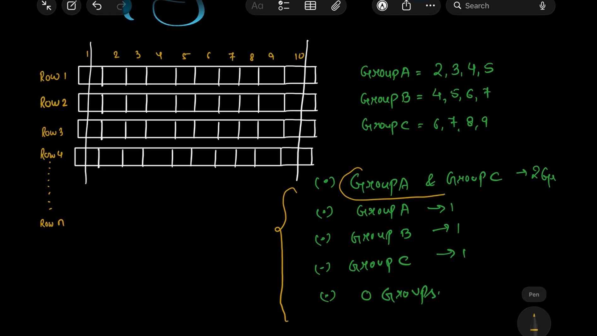

observation
1 and 10 nhi  dekhna 
pair deklo possible

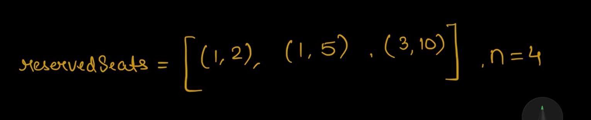
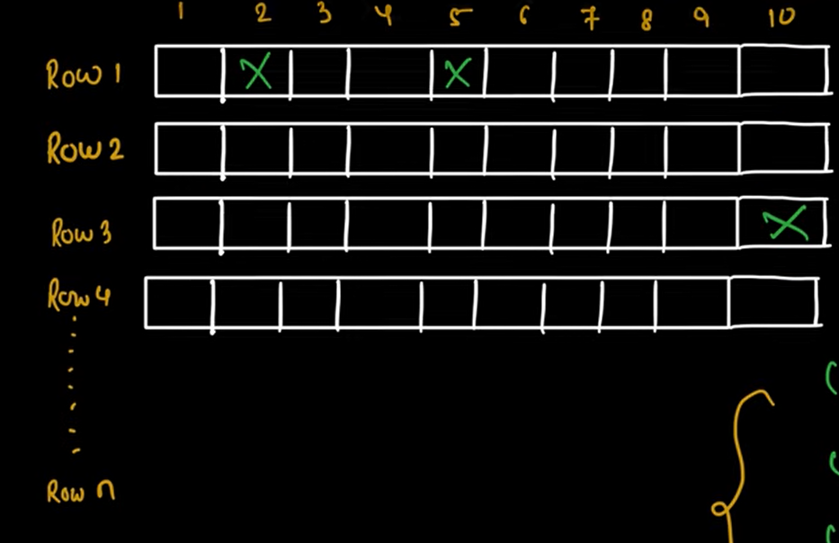

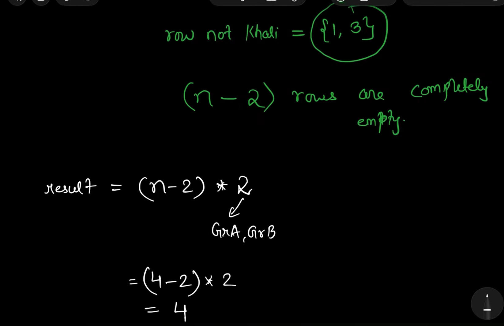

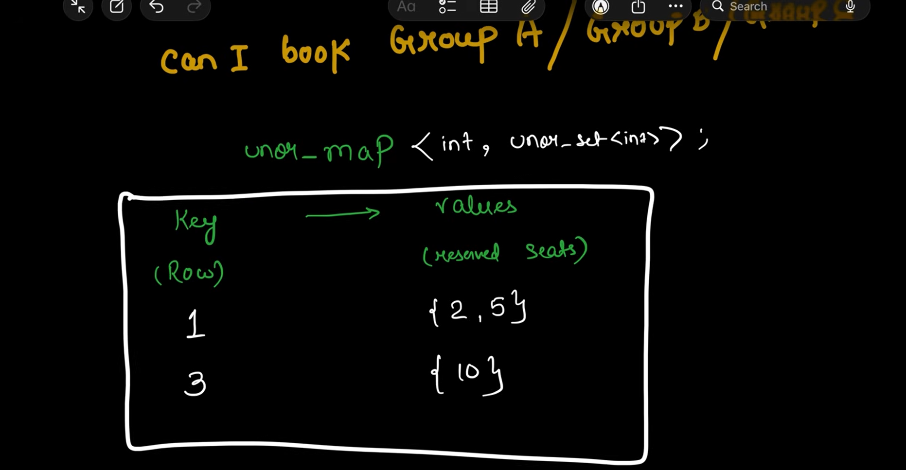

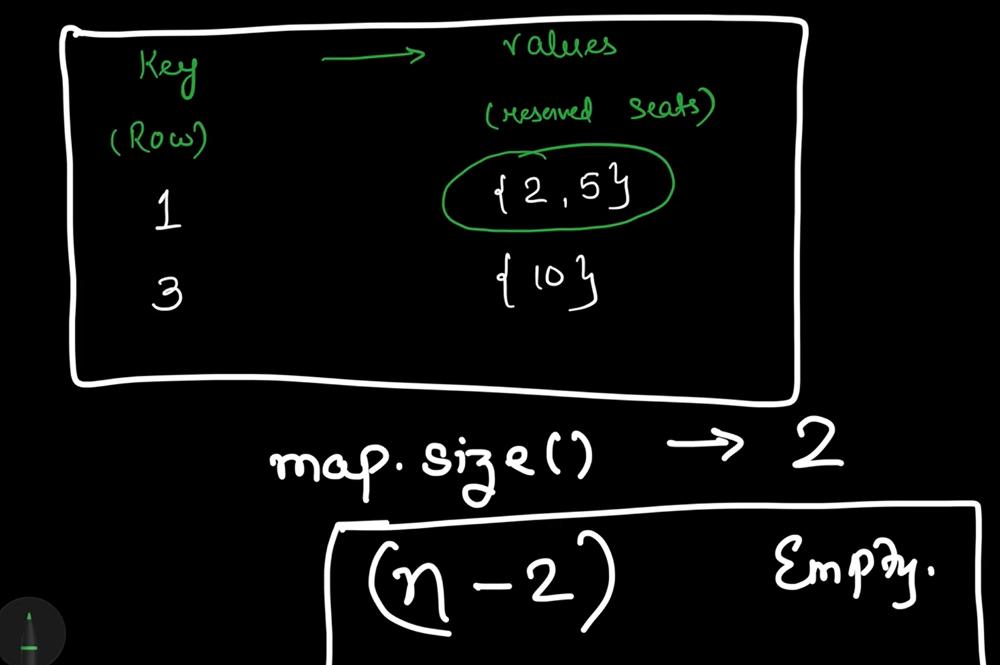

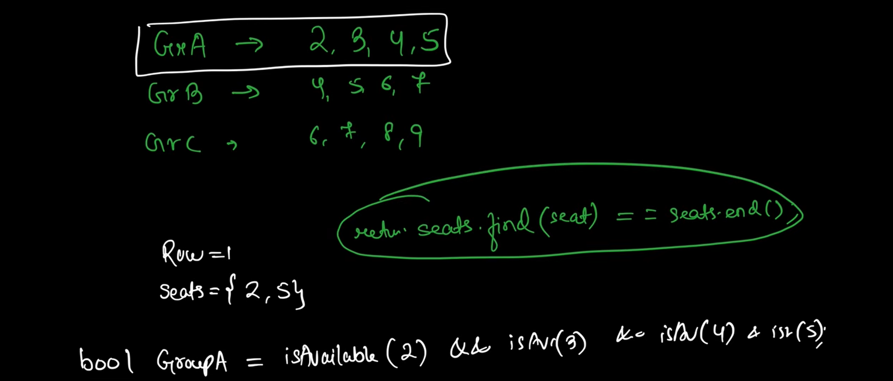                                                           

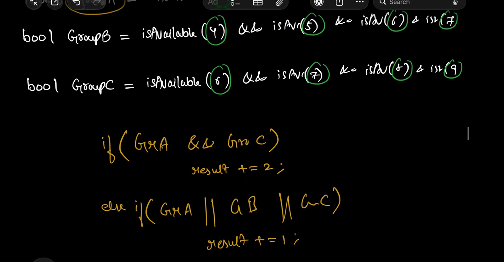

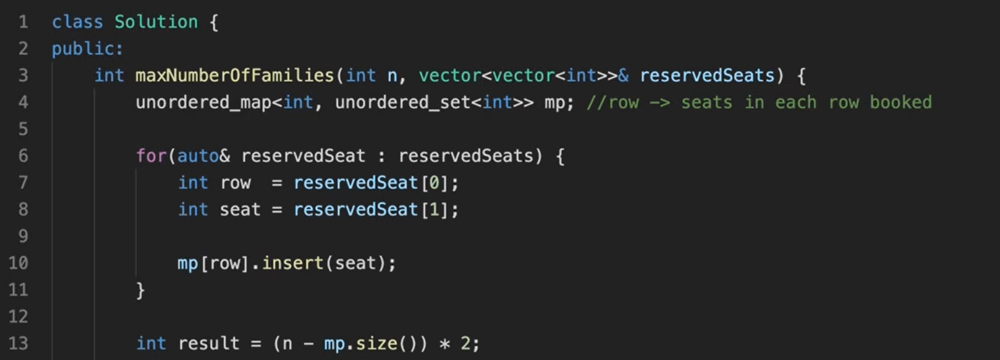

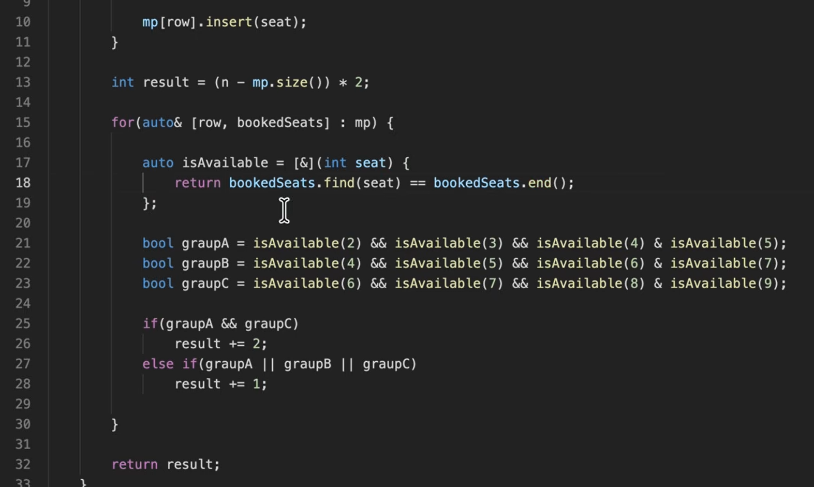

optimisizing space
since only 10 col

so left shift 1 by booked 
in binto know booked
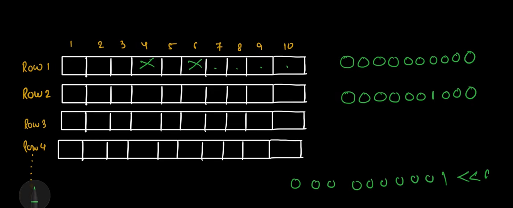
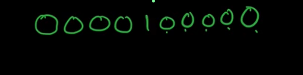

masked   is enought to know booked seats

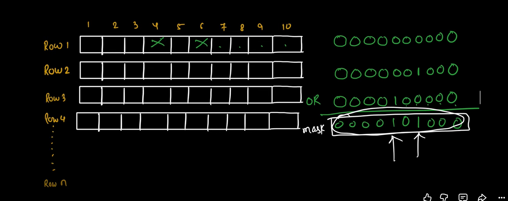

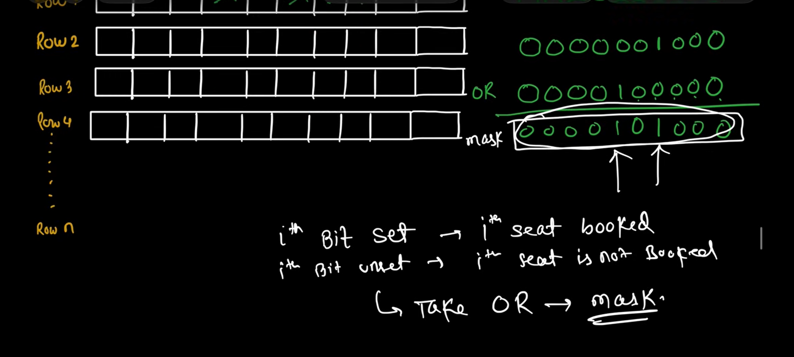

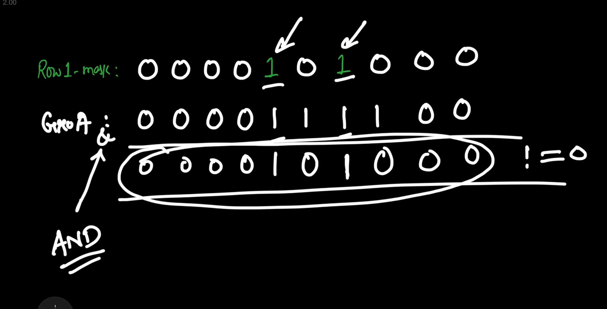

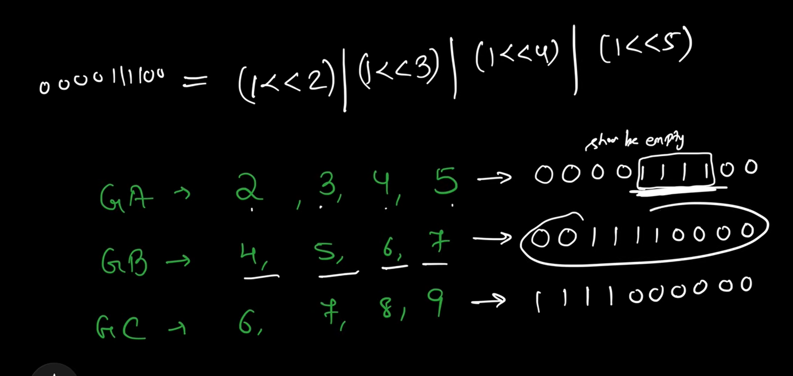

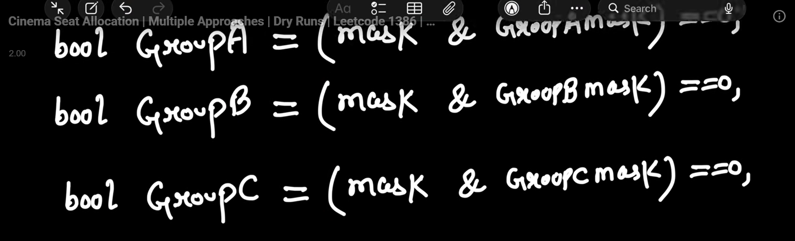

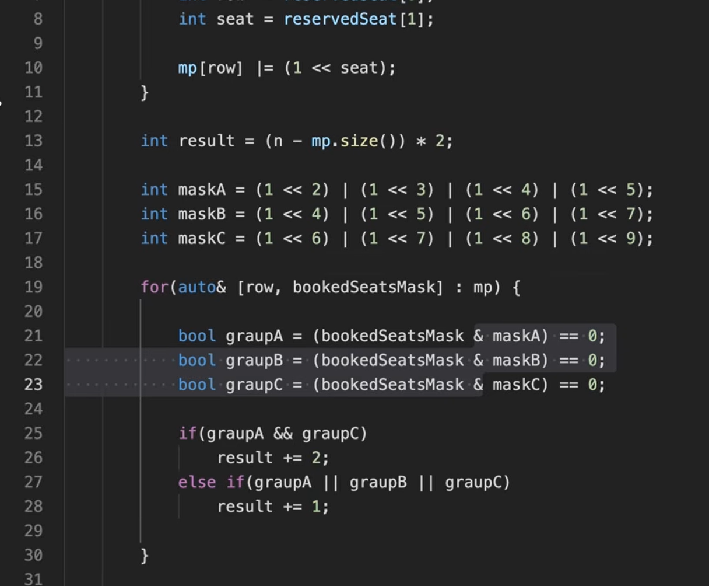